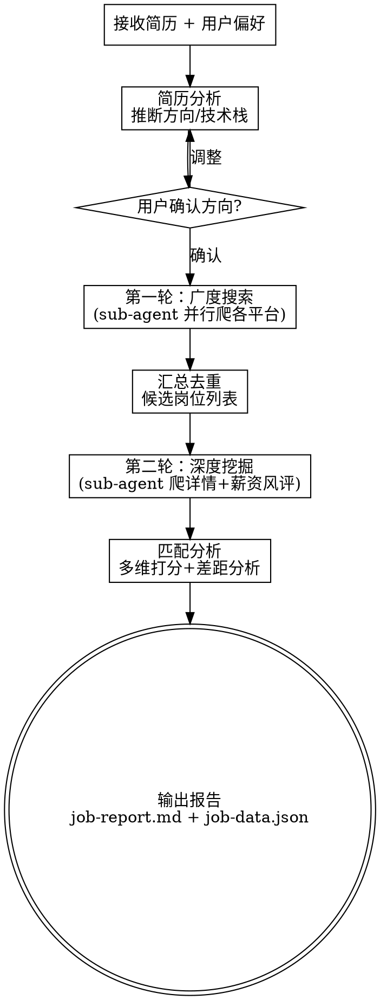

# Job Hunter（自动化社招岗位海选）

## Overview

自动化社招岗位海选工具。接收简历 + 用户偏好，通过 sub-agent 并行爬取多平台社招岗位，智能匹配打分并整合薪资/风评数据，输出完整求职报告。

## When to Use

- 用户想找工作，需要岗位推荐
- 有简历想知道适合什么岗位
- 想对比多家公司的薪资和风评
- 想了解自己与目标岗位的差距

## Core Flow



## 输入

### 简历（必选）
支持 PDF / Word / 纯文本 / Markdown。`resume-builder` skill 输出可直接使用。

### 用户偏好（对话中询问，全部可选）

| 偏好 | 默认 | 示例 |
|------|------|------|
| 期望城市 | 全国 | 深圳、北京 |
| 薪资范围 | 不限 | 25k-40k |
| 公司规模 | 不限 | 大厂/中型/创业 |
| 远程/坐班 | 不限 | 远程优先 |
| 加班强度 | 不限 | 拒绝996 |
| 行业黑名单 | 无 | 外包、博彩 |

## Sub-agent 架构

**主 agent**：协调调度、简历分析、匹配打分、报告生成（保持精简上下文）。

**爬虫 agent（并行，独立上下文）**：

### 第一轮：广度搜索（按平台分）
- Agent A → Boss直聘搜索
- Agent B → 拉勾/猎聘搜索
- Agent C → 大厂官网 careers

每个 agent 用 Playwright MCP 操作浏览器，返回 JSON 岗位列表。

### 第二轮：深度挖掘（按企业分）
- 每个 agent 负责 1-2 家企业
- 爬 JD 全文 + 查看准网薪资/风评

### Agent Prompt 示例

```
搜索 Agent:
"在 {platform} 搜索 '{keyword}' 社招岗位，城市={city}。
 爬取前 N 页，每个岗位提取：公司名、岗位名、薪资、年限要求、技术栈、链接。
 输出 JSON 数组。"

详情 Agent:
"进入 {url} 提取 JD 全文。
 在看准网搜索 '{company}'，提取：薪资、评分、面试评价。
 输出 JSON。"
```

## 匹配分析

### 打分维度

| 维度 | 权重 |
|------|------|
| 技术栈匹配度 | 35% |
| 薪资匹配 | 20% |
| 年限匹配 | 15% |
| 行业相关度 | 15% |
| 用户偏好命中 | 15% |

### 差距分析

每个岗位输出：
- **匹配点**：直接命中的技能/经验
- **差距项**：JD 要求但简历缺少的
- **可补齐度**：有相关经验 → "可快速补齐"；完全陌生 → "需系统学习"
- **建议**：面试重点、学习路径

## 数据源

| 平台 | 用途 | 方式 |
|------|------|------|
| Boss直聘 | 岗位搜索 | Playwright |
| 拉勾 | 岗位搜索 | Playwright |
| 猎聘 | 岗位搜索 | Playwright |
| 企业官网 | JD详情 | Playwright |
| 看准网 | 薪资+风评 | web_fetch / Playwright |
| 职级对标 | 薪资参考 | web_fetch |
| 脉脉 | 风评补充 | web_fetch / Playwright |

**Fallback**：单平台爬取失败不阻断流程，跳过并标注。

## 输出

### job-report.md

```markdown
# 求职报告
生成时间 | 目标方向 | 筛选条件

## 推荐岗位 TOP N
### 1. 公司 — 岗位
- 匹配度：85%
- 薪资：30k-50k（看准网）
- 风评：4.2/5 | "技术氛围好"
- 匹配点：Java / Spring Cloud / 微服务
- 差距：K8s（有 Docker 经验，可快速补齐）
- 建议：重点投递，准备分布式事务相关
- 链接：[JD](url)

## 薪资概览表
## 公司风评汇总表
## 差距总结 & 学习建议
```

### job-data.json
同构 JSON，方便导出 Excel 或接其他工具。

## 工具依赖

| 工具 | 必须/可选 |
|------|-----------|
| Playwright MCP | 必须 |
| sub-agent 能力 | 必须 |
| web_search | 可选 |
| web_fetch | 可选 |

## 边界

- ✅ 岗位搜索、匹配分析、薪资风评整合、报告生成
- ❌ 不做简历编写（交 resume-builder）
- ❌ 不做自动投递（风险高，用户手动）
- ❌ 不做面试辅导（可作为未来 skill）

## Common Mistakes

| 错误 | 修正 |
|------|------|
| 爬虫 agent 上下文太大 | 保持独立精简，只返回 JSON 结果 |
| 单平台失败就中断 | Fallback 跳过，用其他源补充 |
| 匹配只看技术栈 | 多维度打分，含薪资/偏好/年限 |
| 不标注数据来源 | 每条薪资/风评数据标注出处 |
| 差距只列出缺项 | 还要分析可补齐度和建议 |
